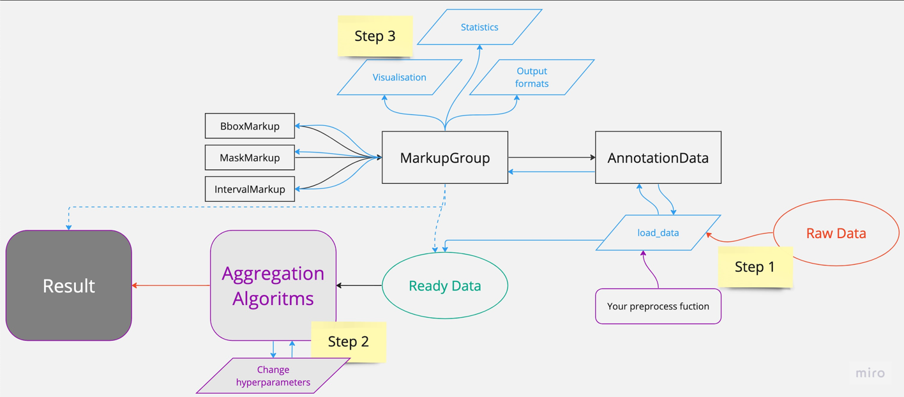

## Utilities and processing module

### Prepare data
The main data-transfer object are `AnnotationData`.

All annotations grouped by **image/video names** will be loaded in `MarkupGroup`.

To **load** data from raw pandas **DataFrame** or simple **json** please read instructions below.



First of all, please look into templates:
```json lines
"""
// BBoxes
{
    "sample_id": {
        "markups": {
            "annotator_id": [
                {"label_1": [[x0, y0, h0, w0], [x1, y1, h1, w1]], "label_2": [[x2, y2, h2, w2]]},
                {"label_1": [[x3, y3, h3, w3], [x4, y4, h4, w4]]}
            ]
        },
        "dimension": dimension,
    }
}
// Masks
{
    "sample_id": {
        "markups": {
            "annotator_id": [
                 {"label_1": [*mask*], "label_2": [*mask*]},  // mask - binary np.array()
         ]
         },
        "dimension": dimension,
    }
}
// Intervals
TEMPLATE = {
    "sample_id": {
        "markups": {
            "annotator_id": [
                {"class_id_1": [[start, end], [start_1, end_1]], "class_id_2": [[start, end]]},
                {"class_id": [[start, end]]}, ...
            ]
        },
        "dimension": dimension,
    },
    "sample_id_2": {/*...*/}
}
```
_*masks should be in `np.array` type. Our framework provides `polygon_to_mask` function._

_**image bboxes coordinates and intervals should be in absolute coordinates OR provide dimensions!_

_***annotator_id == human name or network name, to which annotation belongs._

You need to prepare your raw data to template format that we provided. See examples in `framework.utils.processing.py`

As long as you have `preprocess_func` loading data is simple:

```python
from aggme.utils import AnnotationData
from aggme.utils.processing import synthetic_bboxes_to_template

ann_data = AnnotationData(markup_type='Bbox')
RAW_DATA = ...
preprocess_func = synthetic_bboxes_to_template

ann_data.load_markups(RAW_DATA, preprocess_func)
# OR
ann_data.load_markups_iter(RAW_DATA, preprocess_func)
```

Since data was loaded you can take access to data with:
```python
for group in ann_data.groups[:5]:
    print(group)
```

### Visualization

To visualize loaded data we provide `Visualization` module.

`Visualizer` class can be initialised with object you want to visualize to set up visualization function.

```python

from aggme.utils import Visualizer

# load data
ann_data = ...

# get group and specific markup
group = ann_data.groups[0]
markup = group.data[0]

# get results from aggregation module
results = ...

vis_g = Visualizer(group)
vis_m = Visualizer(markup)
vis_r = Visualizer(results)

params = {...} # set up parameters to pass to vizualise_func

vis_g.draw(group, **params)
... # etc
```


Also, you can provide your own visualization function with `.set_draw_function()` method

### What is next?

Since the data was successfully loaded, next step is [aggregation](https://gitlab.ai.cloud.ru/rndcv/aggregator/-/blob/main/aggme/aggregation)

See specific examples at [AggMe usage examples](https://gitlab.ai.cloud.ru/rndcv/aggregator/-/tree/main/examples)
