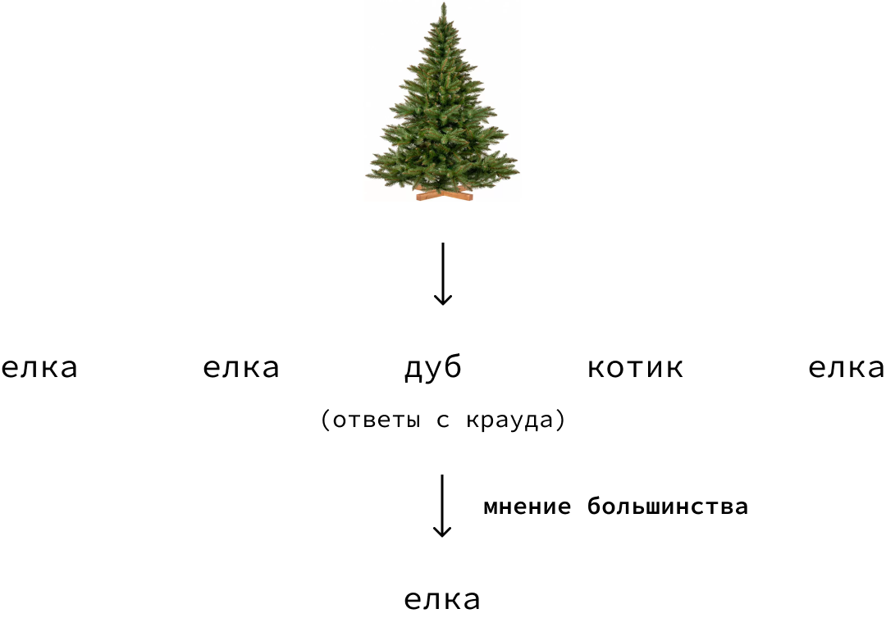
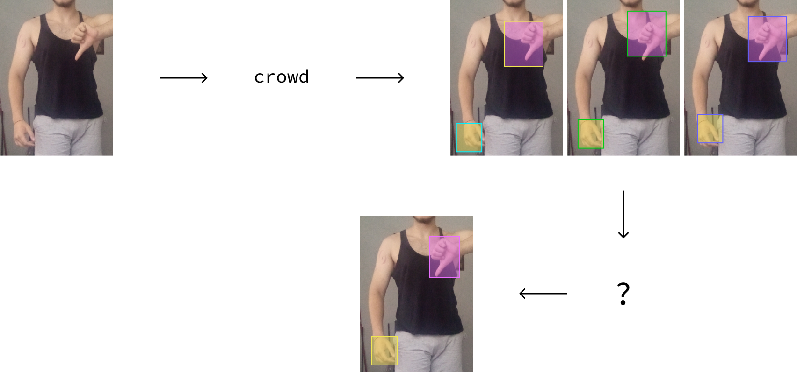
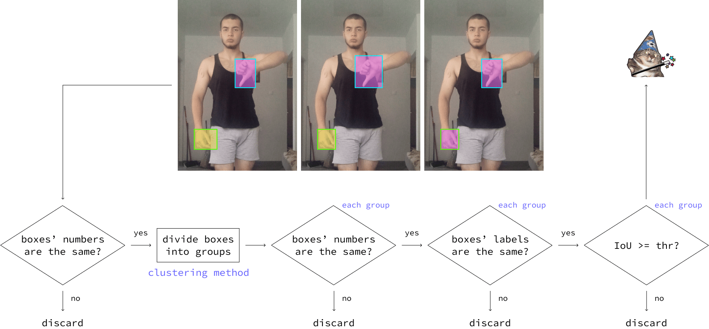
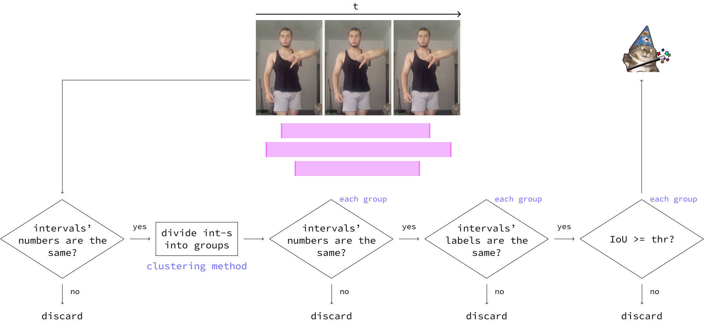
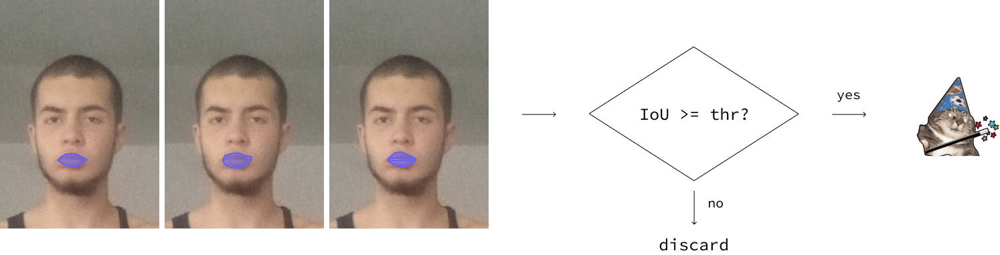
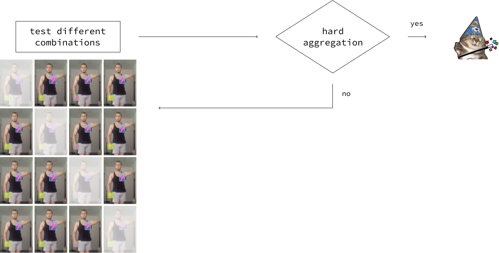
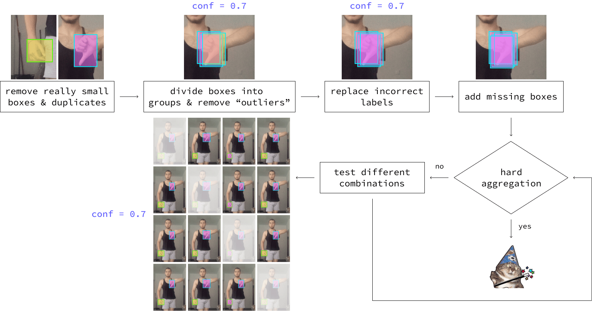
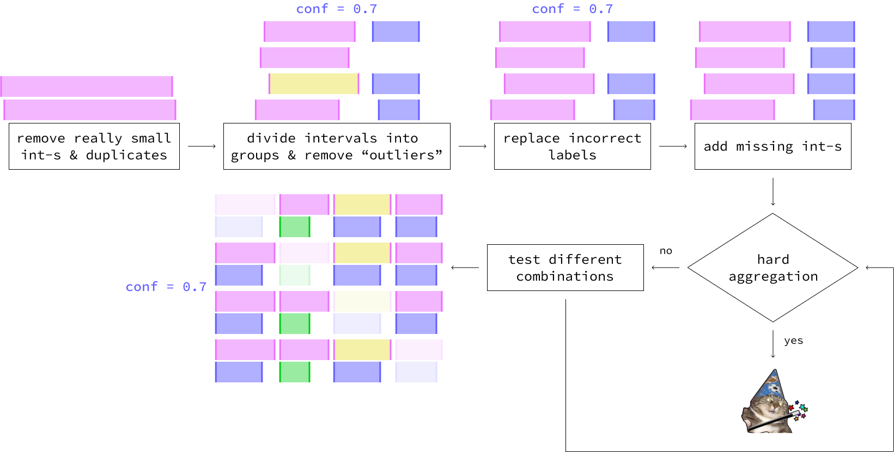
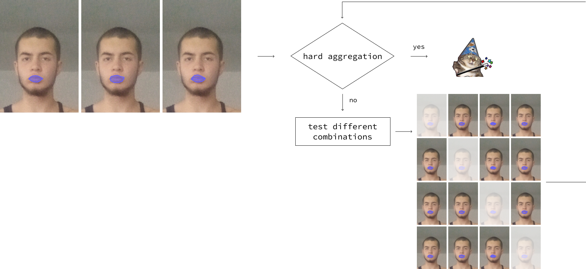
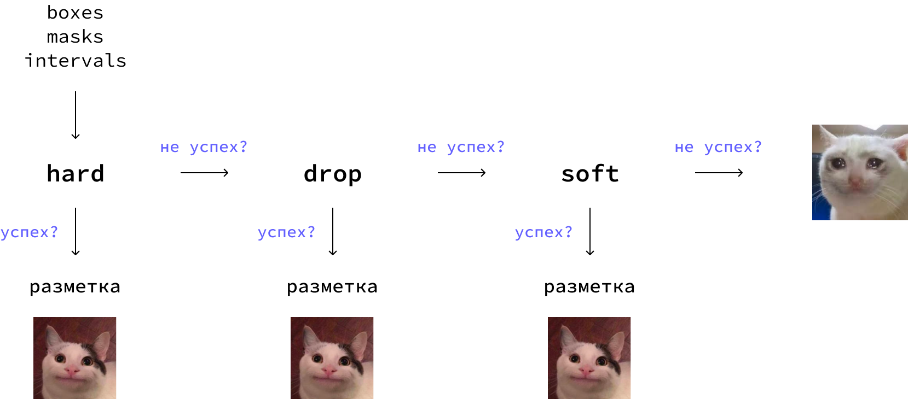

# **Инструкция**
AggMe – python-библиотека, основанная на методах агрегации разметки с краудсорсинг платформ. Полученная с некоторым перекрытием *n* разметка обрабатывается и преобразуется в финальную разметку с высокой уверенностью: *Aggregation(x1, x2, .., xn) = y*, где *xk* — ответ разметчика *k*, *y* — итоговая разметка. И ответ разметчика, и итоговая разметка может содержать несколько сущностей — для каждого из объектов в сэмпле. На данный момент методы реализованы для 3х типов разметки: bounding boxes, временные интервалы и сегментационные маски.

## Простыми словами
При разметке сэмплов для задачи классификации на краудсорсинг платформах реализован метод «мнение большинства».



Для таких задач компьютерного зрения, как детекция (разметка bounding boxes) и сегментация (разметка сегментационными масками) метод не подходит. Фреймворк — реализация некоторого подобия «мнения большинства» для менее типичной разметки по сравнению с метками для классификации.



## Обзор методов
Для наиболее эффективной работы реализованы 3 метода агрегации для каждого из типов разметки:

#### <u>Hard Aggregation</u>
Данный метод проверяет все $n$ разметок на полную идентичность между собой. В случае успеха, метод возвращает усредненные координаты всех разметок для каждого сэмпла. Метод ничего не возвращает в обратном случае, пользователю стоит перейти к следующему методу. Hard Aggregation гарантируют высокую уверенность финальной разметки, поэтому используется в качестве обязательной постпроверки в каждом из следующих методов.

* **Схема Hard Aggregation для боксов**



* **Схема Hard Aggregation для интервалов**



* **Схема Hard Aggregation для масок**



#### <u>Drop Aggregation</u>
Неудачная попытка применения Hard Aggregation говорит о том, что как минимум одна разметка содержит ошибку (отличается от остальных). Drop Aggregation прогоняет всевозможные комбинации разметок (с учетом заданного confidence) через Hard Aggregation.

* **Схема Drop Aggregation для боксов/интервалов/масок**



#### <u>Soft Aggregation</u>
Единственный из трех методов, который может модифицировать разметку изнутри. Нацелен привести разметку в консистентный вид (когда все *n* разметок идентичны между собой) для успешной обработки с помощью Hard Aggregation. Каждая модификация обусловлена уверенностью в какой-либо характеристики. Например, если всего *n* = 5 разметок и *q* = [2, 2, 2, 1, 2], где *q*[*i*] — количество bounding boxes (далее боксы) *i*-й разметки. Тогда, если *confidence* ≤ 0.8, 4-х разметок из 5 достаточно, чтобы сделать вывод, что на фото 2 объекта.

* **Схема Soft Aggregation для боксов**



* **Схема Soft Aggregation для интервалов**



* **Схема Soft Aggregation для масок**



**Общий пайплайн выглядит следующим образом:**



**Общие параметры:**

|Параметры|Тип|Описание|Где используется|
| :- | :- | :- | :- |
|threshold|float|IoU (Intersection over Union) threshold|Hard, Drop, Soft|
|confidence|float|the confidence|Soft|
|drop\_num|int|the number of markups to drop|Drop|

## Типы разметки
В настоящий момент, фреймворк поддерживает обработку 3х типов разметки в Computer Vision:

#### <u>Bounding Boxes & Time Intervals</u>
♦ Рассматриваются вместе из-за полной идентичности в методах и подходах агрегации.

```aggme.aggregation.bounding_boxes.BboxAggregation``` - BboxAggregation

```aggme.aggregation.time_intervals.IntervalAggregation``` - IntervalAggregation(BboxAggregation)

```python
BboxAggregation(
    self,
    cluster_method_name: str = "mean_shift", # метод кластеризации, на данный момент доступны mean_shift и dbscan
    cluster_method_params: Optional[dict] = None, # параметры метода кластеризации
)

# все логические методы идентичны методам BboxAggregation
# меняется лишь IoU в 2d на IoU в 1d и метод кластеризации 
IntervalAggregation( 
    self, 
    cluster_method_name: str = "dbscan", # метод кластеризации, на данный момент доступны mean_shift и dbscan
    cluster_method_params: Optional[dict] = None, # параметры метода кластеризации
)
```
**Methods summary**
|Main method|Description|
| :- | :- |
|```hard_aggregation```|Метод Hard Aggregation.|
|```drop_aggregation```|Метод Drop Aggregation: прогоняет все комбинации разметок, удовлетворяющих указанным параметрам, через Hard Aggregation.|
|```soft_aggregation```|Метод Soft Aggregation: проверяет разметку с перекрытием на консистентность и, в худшем случае, модифицирует ее с целью приведения к одному виду.|
|```get_aggregation_results```|Последовательно применяет методы к разметке в следующем порядке: Hard Aggregation, Drop Aggregation (если не прошла через Hard), Soft Aggregation (если не прошла через Drop). Разметка, которую не получилось съагрегировать, выводится отдельно.|

|Auxiliary method|Description|
| :- | :- |
|```_aggregate```|Агрегирует разметки: делит разметку с перекрытием на группы с помощью ```_check_by_centroids``` и проверяет каждую группу на IoU. После — усредняет разметки в каждой из групп.|
|```_check_by_centroids```|Делит разметку с перекрытием на группы одним из 2х способов: 1) проверяя вхождение центра бокса в группу (быстро, но может не сработать), 2) методом кластеризации (долго, но сработает с большей вероятностью). После каждого способа проверяет группы на полноту, с помощью ```_check_matching```.|
|```_check_count```|Группу из *k* боксов приводит к группе из *n* боксов (обозначения из ```_check_matching```), используется для успешной обработки с помощью Hard Aggregation в конце ```soft_aggregation```. Усредненный бокс из *k* имеющихся добавляется в группу *n* - *k* раз.|
|```_check_labels```|Проверяет группу на идентичность по меткам. В том случае, когда *k* разметок из *n* отнесены к классу *label*, *k* ≥ *n * confidence*, класс остальных *n* - *k* разметок заменяется на *label*.|
|```_check_matching```|Проверяет группу на полноту: 1) если она вызвана НЕ из ```soft_aggregation```, то группа считается полной, если содержит все *n* боксов; 2) в ином случае группа считается полной, если содержит *k* боксов, *k* ≥ *n * confidence*.|
|```_markups_filter```|Удаляет боксы, считающиеся слишком маленькими / дубликатами по указанным параметрам.|
|```_res_to_group```|Приводит полученный результат к ```MarkupGroup```.|

#### <u>Segmentation Masks</u>

```aggme.aggregation.segmentation_masks.MaskAggregation``` - MaskAggregation

```python
MaskAggregation(
    self,
    cluster_method_name: str = "mean_shift", # в методах не используется
    cluster_method_params: Optional[dict] = None, # параметры метода кластеризации
)
```
**Methods summary**
|Main method|Description|
| :- | :- |
|```hard_aggregation```|Метод Hard Aggregation.|
|```drop_aggregation```|Метод Drop Aggregation: прогоняет все комбинации разметок, удовлетворяющих указанным параметрам, через Hard Aggregation.|
|```soft_aggregation```|Метод Soft Aggregation: в отличии от Drop Aggregation может удалить только часть разметки одного разметчика, тем самым увеличивая шансы на агрегацию.|
|```get_aggregation_results```|Последовательно применяет методы к разметке в следующем порядке: Hard Aggregation, Drop Aggregation (если не прошла через Hard), Soft Aggregation (если не прошла через Drop). Разметка, которую не получилось съагрегировать, выводится отдельно.|

|Auxiliary method|Description|
| :- | :- |
|```_aggregate```|Агрегирует разметки: делит разметку с перекрытием на группы по меткам и проверяет каждую группу на IoU с помощью ```get_group_ious```. После — усредняет разметки в каждой из групп.|
|```_res_to_group```|Приводит полученный результат к ```MarkupGroup```.|
|```get_group_ious```|Для каждой из групп считает IoU для всех комбинаций разметок по 2. Ставит статус rejected разметчику, который не прошел порог по среднему IoU своей разметки.|

## Типы данных
Данные любого типа перед обработкой методом агрегации необходимо обернуть в AnnotationData.

#### <u>AnnotationData</u>

```aggme.utils.processing.AnnotationData```

```python
AnnotationData(
    self,
    markup_type: str, # тип данных, на данный момент доступны bboxes, mask, interval
    point_threshold: Optional[float] = None, # порог для обнаружения слишком маленьких (вероятно, случайно нарисованных) объектов
    duplicate_threshold: Optional[float] = None, # порог для обнаружения дубликатов в рамках разметки от одного разметчика
)
```
**Methods summary**
|Main method|Description|
| :- | :- |
|```load_markups```/```load_markups_iter```|Загружает данные, приводит их к шаблону (aggme/utils/processing.py) и преобразует в MarkupGroup c помощью ```_preprocess```/```_preprocess_iter```.|

|Auxiliary method|Description|
| :- | :- |
|```_get_markup```|Оборачивает разметку в BboxMarkup/MaskMarkup/IntervalMarkup согласно ```markup_type```.|
|```_preprocess```/```_preprocess_iter```|Итерируется по каждому сэмплу и создает соответствующую ему MarkupGroup.|

#### <u>MarkupGroup</u>

```aggme.utils.dataclass.MarkupGroup```

```python
MarkupGroup(
    self,
    name: str,
    data: List[BboxMarkup | MaskMarkup | IntervalMarkup],
    dimension: Optional[Tuple[int, int]],
    relative: bool,
    point_threshold: float = 0.001,
    duplicate_threshold: float = 0.85,
)
```
**Methods summary**
|Main method|Description|
| :- | :- |
|```fill_missing```|Добавляет недостающие маски по меткам каждому разметчику.|
|```drop_markups```|Удаление из группы переданной разметки. Возвращает список id разметчиков для последующего отклонения их ответов (наличие дубликатов и/или слишком маленьких объектов считается ошибкой).|
|```get_annotators```/```get_labels```|Возвращают список разметчиков и меток для обрабатываемого сэмпла.|
|```get_duplicates```/```get_points```|Ищет дубликаты и слишком маленькие объекты по соответствующим порогам.|
|```get_groups_by_annotators```/```get_groups_by_labels```|Разбивает всю разметку на группы по разметчикам или по меткам. Рассмотрим на примере:<br>[(annotator: ann1, markup: (label1, box1)), (annotator: ann2, markup: (label1, box2)), (annotator: ann1, markup: (label2, box3))],<br>⋅ группы по разметчикам:<br>group1 = [(annotator: ann1, markup: (label1, box1)), (annotator: ann1, markup: (label2, box3))],<br>group2 = [(annotator: ann2, markup: (label1, box2))],<br>⋅ группы по меткам:<br>group1 = [(annotator: ann1, markup: (label1, box1)), (annotator: ann2, markup: (label1, box2))],<br>group2 = [(annotator: ann1, markup: (label2, box3))].|

|Auxiliary method|Description|
| :- | :- |
|```_remove```|Удаление из группы переданной разметки. Используется в ```drop_markups``` для удаления дубликатов и/или слишком маленьких объектов.|
|```convert_to```|Приводит объекты к нужному типу. На данный момент реализован перевод координат боксов в типы voc и coco. Функция конвертирования может быть написана пользователем.|

#### <u>[MarkupType]Markup</u>
Полностью описывают каждую разметку: хранят ее метку, координаты и разметчика.

```aggme.utils.dataclass.BboxMarkup```

```aggme.utils.dataclass.IntervalMarkup```

```python
BboxMarkup(
    self,
    label: str,
    coordinates: tuple | list,
    annotator: str,
)

# все логические методы идентичны методам BboxMarkup
IntervalMarkup(
    self,
    label: str,
    coordinates: tuple | list,
    annotator: str,
)
```
**Methods summary**
|Main method|Description|
| :- | :- |
|```check_matching```|Проверяет принадлежность координат центра одной разметки другой. Используется в ```Bbox[Interval]Aggregation._check_by_centroids.```|
|```expand_markup```|Разворачивает разметку — возвращает ее координаты.|
|```get_center```|Возвращает координаты центра разметки. Используется в ```Bbox[Interval]Aggregation._check_by_centroids```.|
|```point_detection```|Проверяет разметку на «слишком маленький объект».|
|```set_label```/```set_data```|Меняет метку/координаты разметки на метку/координаты другой разметки. Применяется, например, при замене меток в Soft Aggregation.|

```aggme.utils.dataclass.MaskMarkup```

```python
# все логические методы идентичны методам BboxMarkup и IntervalMarkup
IntervalMarkup(
    self,
    label: str,
    mask: np.array,
    annotator: str,
)
```
**Methods summary**
|Main method|Description|
| :- | :- |
|```add_iou```|Для каждой разметки добавляет в соответствующий ей список значение метрики IoU с каждой из остальных разметок для того же сэмпла. Используется в ```get_avg_iou```.|
|```expand_markup```|Возвращает маску (сделано для унификации некоторых функций с боксами/интервалами).|
|```get_avg_iou```|Возвращает среднее значение IoU из списка. Это значение говорит о том, насколько разметка согласована с остальными.|
|```iou```|Возвращает значение IoU для двух разметок.|

## Материалы по теме
* «Majority vote for CV annotations: improve your data labeling pipeline» | [Видео](https://www.youtube.com/watch?v=CoEtiW5ZEQI)
* «Мнение большинства для разметки данных в задачах компьютерного зрения» | [Habr](https://habr.com/ru/companies/sberdevices/articles/747464/)
* «Рецепт идеальной разметки в Computer Vision» | [Презентация](https://docs.google.com/presentation/d/1gY5UYLGeL9Ksz0X3u2h3fZ7_CF1h9EEA7wrK5R0P2g0/edit#slide=id.g29be8166451_0_11)
* «Рецепт идеальной разметки в Computer Vision» | [Habr](https://habr.com/ru/companies/oleg-bunin/articles/833994/)
