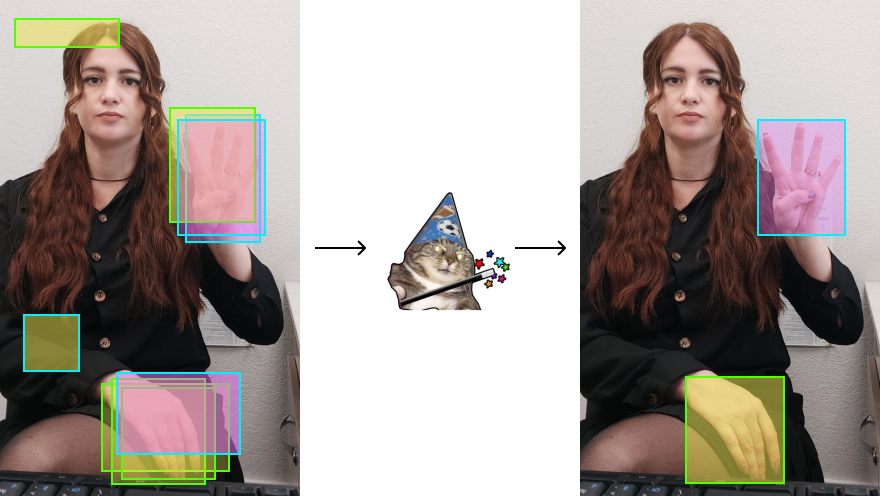
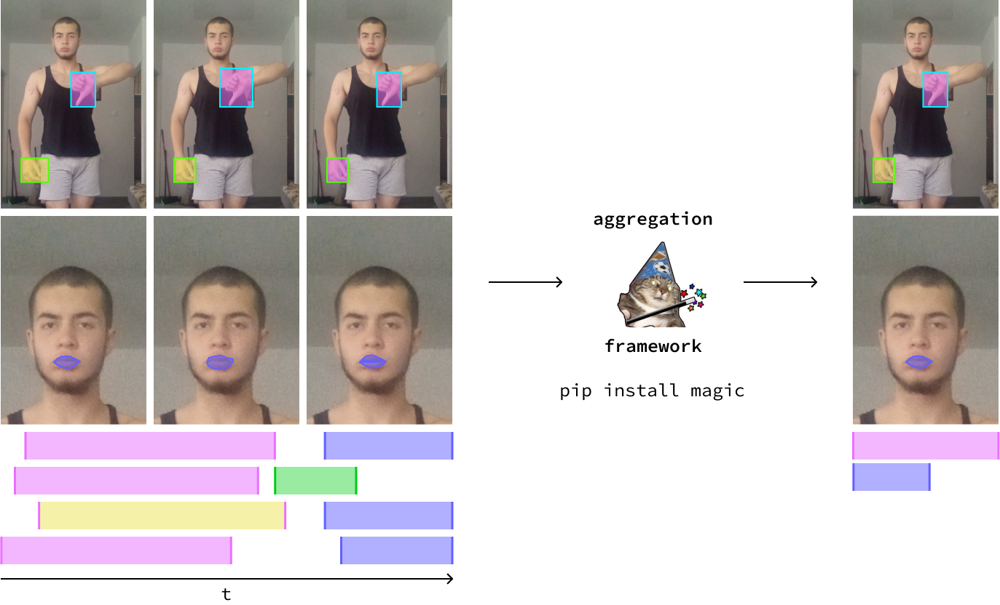

# AggMe

AggMe is a python framework for aggregating overlapped annotations in computer vision tasks (object detection, semantic or instance image segmentation, video annotation).

It allows you to aggregate the annotations from __crowdsourcing platforms__ or generated from __neural networks__.
Current version of **AggMe** supports several types of data:

- Bounding Boxes (`images`)
- Segmentation Masks (`images`)
- Time Intervals (`video timeline` or `audio timeline`)



## Get Started
1. Install the **AggMe** package. Run the following command in the command shell:
```shell
$ pip install aggme
```

Note that `aggme` framework supports only `python=3.10+`

2. To use __AggMe__ with `Visualisation` module and see results, install `jupyter notebook`
```shell
$ pip install notebook
```

3. Simple code example to start using framework:
```python
from aggme.aggregation import BboxAggregation
from aggme.utils import AnnotationData
from aggme.utils.processing import toloka_bboxes_to_template
import pandas as pd


df = pd.read_csv("markups.csv") # read dataframe with annotations
data = AnnotationData(markup_type='bboxes') # init aggregator

data.load_markups(df, toloka_bboxes_to_template)

aggregator = BboxAggregation()
results = aggregator.get_aggregation_results(data)
```

## Examples
For more information see `examples` dir.




## Authors and Credits
- [Alexander Kapitanov](https://www.linkedin.com/in/hukenovs)
- [Karina Kvanchiani](https://www.linkedin.com/in/kvanchiani)
- [Alexander Sautin](https://www.linkedin.com/in/alexander-sautin-b5039623b)
- [Viktoria Volf](https://ru.linkedin.com/in/%D0%B2%D0%B8%D0%BA%D1%82%D0%BE%D1%80%D0%B8%D1%8F-%D0%B2%D0%BE%D0%BB%D1%8C%D1%84-080211217)

## Links
- [Majority vote for data annotation in computer vision tasks](https://habr.com/ru/companies/sberdevices/articles/747464/)
- [A recipe for perfect markup in computer vision](https://habr.com/ru/companies/oleg-bunin/articles/833994/)

## License
<a rel="license" href="http://creativecommons.org/licenses/by-sa/4.0/"></a><br />This work is licensed under a variant of <a rel="license" href="http://creativecommons.org/licenses/by-sa/4.0/">Creative Commons Attribution-ShareAlike 4.0 International License</a>.

Please see the specific [license](https://github.com/ai-forever/aggme/blob/master/license/en_us.pdf).